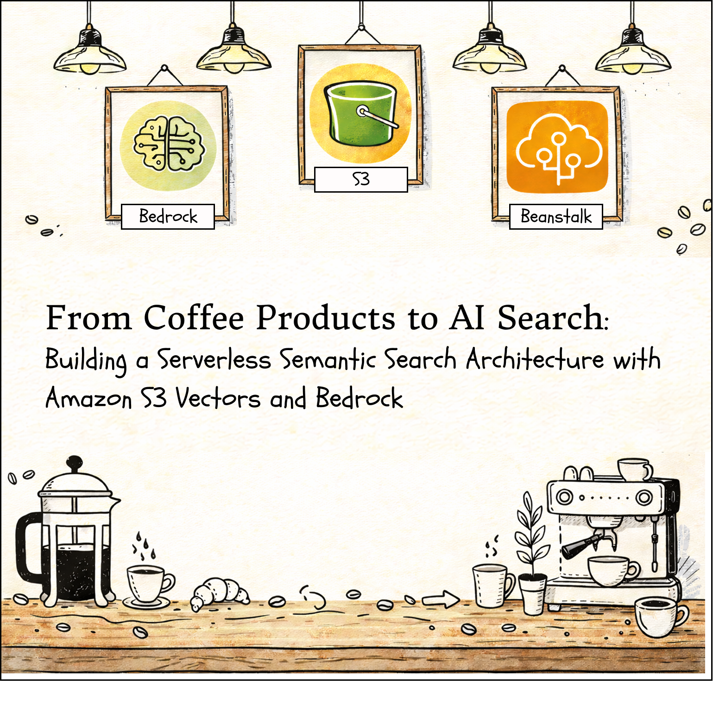
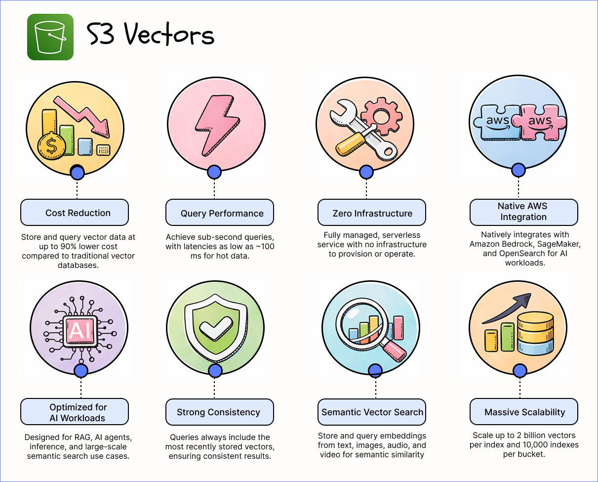
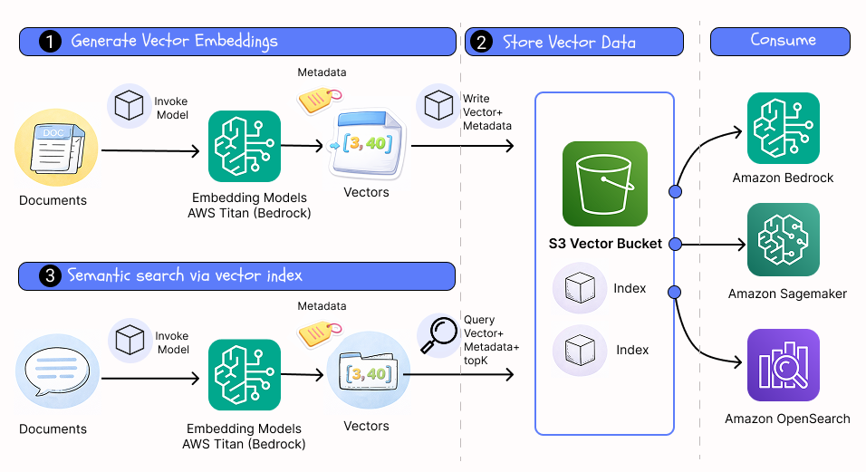
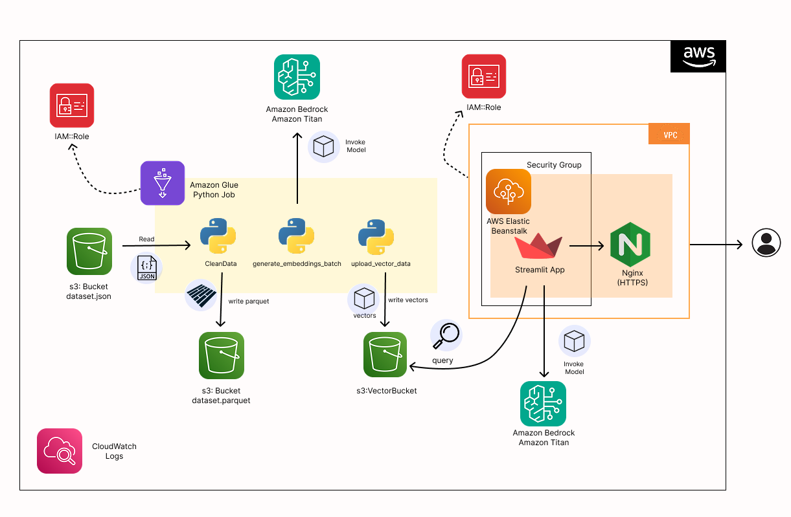
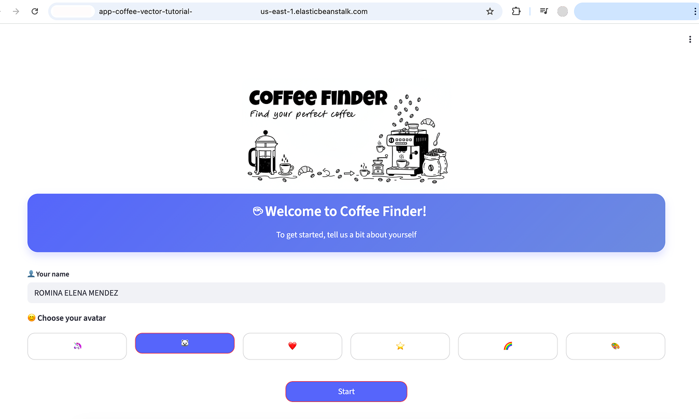
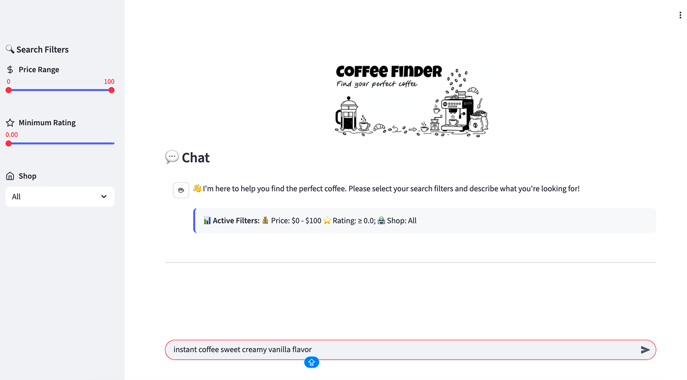
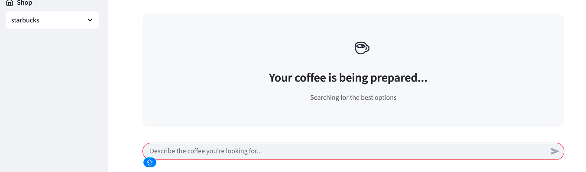
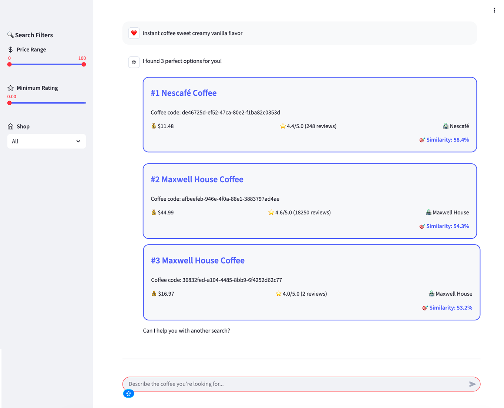

---

# From Coffee Products to AI Search: Building a Serverless Semantic Search Architecture with Amazon S3 Vectors and Bedrock

In recent months, we have increasingly incorporated artificial intelligence into our solutions, and with it a recurring need has emerged: searching and querying our own data using natural language efficiently.

Use cases such as semantic search or building solutions based on Retrieval-Augmented Generation (RAG) are no longer optional. Today, we need to understand the meaning of text, combine it with structured filters, and do so in an efficient and scalable way.
In this article, I explore a recent alternative within the AWS ecosystem: Amazon S3 Vectors 🪣, a serverless approach for vector storage and querying that aims to balance scalability, simplicity, and cost.

To make it more concrete (and a bit more entertaining)...we will work with a dataset of coffee products ☕ and build a complete flow that goes from generating embeddings with Amazon Bedrock 🧠 to an application deployed on AWS with Streamlit ✨, which allows natural language searches combined with filters.

---

# What is Amazon S3 Vectors?
**Amazon S3 Vectors** is a new type of storage within Amazon S3 designed specifically to natively **store and query vectors**.
 In addition to storing vectors, this type of bucket allows associating **structured metadata**, which enables queries that combine **semantic search** with filters on those attributes.
Vector buckets support searches based on distance metrics, such as:
* **Cosine similarity**: measures how similar two vectors are based on the angle between them, and is very common in text embeddings.
* **Euclidean distance**: measures the “geometric” distance between two vectors in space.
Unlike traditional vector databases, Amazon S3 Vectors makes it possible to **implement a fully serverless architecture**, achieving a good balance between `scalability`, `operational` `simplicity`, and `cost`.
Below are some of the main benefits of using this functionality:

---

## How do vectors work in Amazon S3?
Amazon S3 Vectors is based on the following main components:

**🪣 1. Vector buckets**
These are specialized buckets optimized for vector storage.
They support encryption and organize data internally through **vector indexes**, which enables efficient large-scale searches.

**🧭 2. Vector indexes**
An index defines how vectors are stored and queried within the bucket.
In addition to the vector, it allows associating **metadata**, which can later be used in queries through filters with a syntax similar to well-known operators, such as those used in MongoDB.

**🔍 3. Queries**
Queries are based on **similarity searches**, using the distance metric configured when creating the index, such as **cosine** or **Euclidean**.
These searches can be combined with metadata filters to refine results and reduce ambiguities.

**⚙️ 4. API**
**Amazon S3 Vectors** exposes an API that allows querying data through operations such as `QueryVectors`.
These queries can be executed using tools like the **AWS CLI** or **Boto3**, combining a query vector with metadata-based filters and parameters such as the number of results to return or whether to include the distance between vectors.

---

# Process Flow
The previous image shows the complete workflow to implement semantic search using Amazon S3 Vectors, divided into three main stages:

## 1️⃣ Generate Vector Embeddings
The process starts from the input documents. These documents are sent to an embeddings model, in this case **AWS Titan** through **Amazon Bedrock**, which transforms the text into numerical vectors.
At this stage, not only are the vectors generated, but metadata describing each document is also associated.

---

## 2️⃣ Store Vector Data
The generated vectors, together with their metadata, are stored in an **S3 Vector Bucket**.
Within the bucket, the data is organized through one or more **vector indexes**, defined with a specific distance metric.
Being integrated into AWS, this data can be consumed by other services such as **Amazon Bedrock**, **Amazon SageMaker**, or **Amazon OpenSearch**.

---

## 3️⃣ Semantic Search via Vector Index
To perform a search, a natural language query is transformed again into a vector using the same embeddings model.
This query vector, together with metadata filters and the topK parameter, is used to query the vector index and retrieve the most semantically similar results.

---

# Reference Architecture

In this tutorial, the use case is based on processing data initially stored in **JSON** format, which is transformed into **Parquet** as part of a data preparation workflow. From this processed data, the **Amazon Titan** model is invoked through **Amazon Bedrock** to generate embeddings, which are then stored together with their metadata in an **Amazon S3 Vectors bucket**, thus enabling semantic queries over the information.

Data processing is carried out through an **Amazon Glue job in Python**, where a typical clean data stage of any production data pipeline is implemented. In this phase, only the relevant fields are selected, text descriptions are normalized and corrected when necessary, and only after this cleaning is completed is the Titan model invoked. This approach helps optimize costs and performance by avoiding unnecessary model calls on data that will not be used later.

Finally, the data stored in the vector bucket is consumed by an application developed with **Streamlit**, which is deployed on **AWS Elastic Beanstalk** within a VPC. The application allows user queries to be transformed back into embeddings and used to query the vector index, combining semantic search with metadata-based filters, while access to services and system observability are managed through **IAM** roles and **CloudWatch** Logs.

----

# 📊 Dataset
The dataset used in this tutorial was obtained from the **Amazon Reviews 2023 project**, presented in the paper Bridging Language and Items for Retrieval and Recommendation (Hou et al., 2024). This dataset contains reviews and metadata for Amazon products, including titles, descriptions, categories, stores, and ratings.

For this use case, only the **“Grocery_and_Gourmet_Food”** category was selected, and within it, products related to coffee were filtered. This allows us to work with rich textual information and structured attributes that are ideal for semantic search scenarios.

----

# Use Case
The use case presented in this tutorial starts from a simple but representative scenario: a user who wants to query **coffee products** using **natural language**, exploring the available catalog in a more flexible and intuitive way than a traditional search.

To enable this type of query, different textual attributes of the product are used, such as the `title`, `description`, and `category`, which helps better capture user intent. Within the dataset, several coffee-related **categories** are included, such as Coffee, Instant Coffee, Ground Coffee, Whole Coffee Beans, Single-Serve Capsules & Pods, Iced Coffee & Cold-Brew, among others.
Based on this, an application is designed in which the user can interact primarily through natural language, while complementing the search with structured filters to reduce ambiguities. These filters include, for example, **product rating**, **store name** (a detail that users often do not know or remember precisely), and **price**, allowing more accurate and relevant results without relying exclusively on a textual query.

---

> In the`python notebook`  **main.ipynb** you can find the complete ETL implementation for processing data and loading it into **S3 vectors**. In the app folder you can find the Streamlit app and also the **AWS Elastic Beanstalk** implementation.

----

# Full article
[🔗 Dev.to - From Coffee Products to AI Search: Building a Serverless Semantic Search Architecture with Amazon S3 Vectors and Bedrock](https://dev.to/aws-builders/from-coffee-products-to-ai-search-building-a-serverless-semantic-search-architecture-with-amazon-5g5b)
